# API 缺口盤點（對照 API_DOCUMENT.json）

> 最後核對：2026-06-09，對照 `API_DOCUMENT.json` 與最新 spec `api (6).json`（6/5），
> 並用 SM S9280（`com.xsmartlive.plus.one` / `api-uat-1.xsmartlive.com`）
> 開 dio LogInterceptor 攔截真實 response 實機驗證。
> 判定規則：只有當 endpoint 不存在於 OpenAPI 的 `paths` 區段時，才標記為「缺少」。
> **重要區分**：「spec 文檔有」≠「UAT 後端有回」。`api (6).json` 已定義的多個
> 2026-05 新欄位，UAT 後端實測仍未部署、未回傳；下方 `[後端未部署]` 標記即此意。
> 標 `[2026-05 待後端上線]` 者 App 端已做好並有 fallback，後端部署即生效。
>
> （註：先前佐證引用的 `api (5).json (5/25)` 已不在 repo，改以 `api (6).json` 為準。）

分段說明：

| 段 | 意思 |
|---|---|
| **A** | 後端根本沒有這個 API，前端只能用假資料或前端動畫 🔴 |
| **B** | 後端有 API，前端的接線狀況（已接完 / 待接） 🟢 |
| **C** | API 有，但回傳缺了畫面需要的欄位 🟡 |
| **D** | 已移除（內容併入 A 段） |
| **E** | API 有，但後端回 500 / SQL 錯誤 |

---

## A. 後端沒有的 API（🔴 需後端新增）

> 有畫面的項目都附了 `docs/api-gaps/` 截圖，紅框圈出壞掉 / 假資料的元件。
> 截圖環境：2026-05-06、`com.xsmartlive.plus.one`（default flavor）、Galaxy S22 Ultra。

| # | 缺少的功能                                                                | 用在哪 | 說明 | 截圖 |
|---|----------------------------------------------------------------------|---|---|---|
| A1 | **收藏 / 願望清單** — 無 `/favorite`、`/wishlist`、`/collect/product`         | `lib/data/repositories/product_repository.dart:192-198`、`lib/screens/favorites/favorites_screen.dart` | **現況**：收藏整頁為假資料；商城的 `storeCollection` 是「主題館」（商家自選的精選商品集，API_DOCUMENT.json:3751），**與會員收藏無關**，不能拿來當收藏清單。 **後端需提供**： ① `GET /favorite`（分頁）→ 會員收藏的商品列表，每筆為 productCard 摘要 + `favorited_at`； ② `POST /favorite` `{product_card_id}` 加入收藏； ③ `DELETE /favorite/{product_card_id}`（或 `POST /favorite/toggle`）移除； ④ `GET /productCard` 列表／詳情回傳帶 `is_favorited` 布林，讓愛心圖示狀態正確； ⑤ `GET /me` 補 `favorites_count`（見 C5）。 | 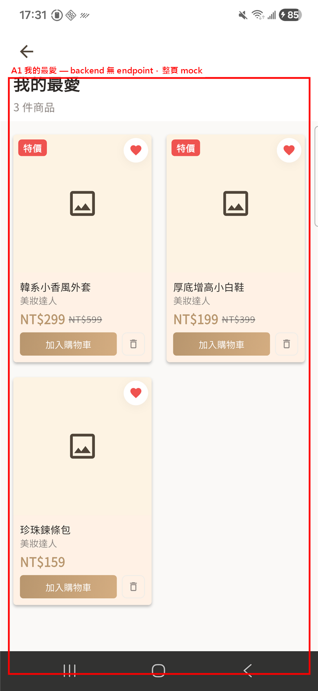 |
| A2 | **通知中心** — 無 `/notification`、`/notice`、`/inbox`                      | `lib/providers/notification_provider.dart:6-9` | **現況**：整頁假資料，4 則通知寫死在 `MockData.notifications`，無已讀狀態、無未讀數 badge。 **後端需提供**： ① `GET /notification`（分頁）→ 通知列表，每筆 `id` / `type`（`order`\|`promo`\|`system`\|`live`）/ `title` / `body` / `link`（App 深連結，如 `/orders/{id}`）/ `is_read` / `created_at`； ② `POST /notification/{id}/read` 與 `POST /notification/readAll` 標記已讀； ③ `GET /notification/unreadCount` → 未讀數（給 tab／鈴鐺 badge）； ④（選配）推播 token 註冊端點，配合 FCM／GA 事件。 | 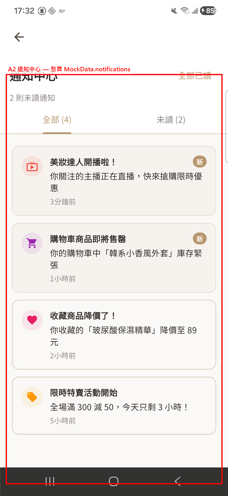 |
| A3 | **追蹤主播 / 我的追蹤** — 無 `/follow`、`/subscribe`                           | 個人頁選單 `lib/screens/profile/profile_screen.dart:142-147`；直播間「+ 追蹤」鈕 `lib/screens/live/live_room_screen.dart:607-622` | **現況**：個人頁選單暫時導去 `/favorites` 充數；直播間頂部「+ 追蹤」是純裝飾 `Container`、**無 onTap**，點了沒反應，也沒有追蹤 API。 **後端需提供**： ① `POST /follow` `{streamer_id}` 追蹤、`DELETE /follow/{streamer_id}` 取消（直播間追蹤鈕用）； ② `GET /follow`（分頁）→ 我的追蹤主播列表（含主播名／大頭貼／是否直播中）； ③ 直播／主播資料帶 `is_followed` 布林，讓追蹤鈕狀態正確； ④ `GET /me` 補 `following_count`（見 C5）。前提：主播需有穩定 `id` 與名稱（見 C15）。 | 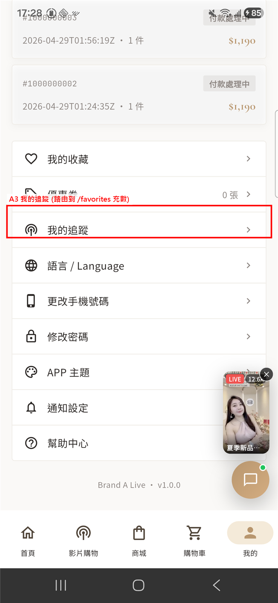 直播間追蹤鈕 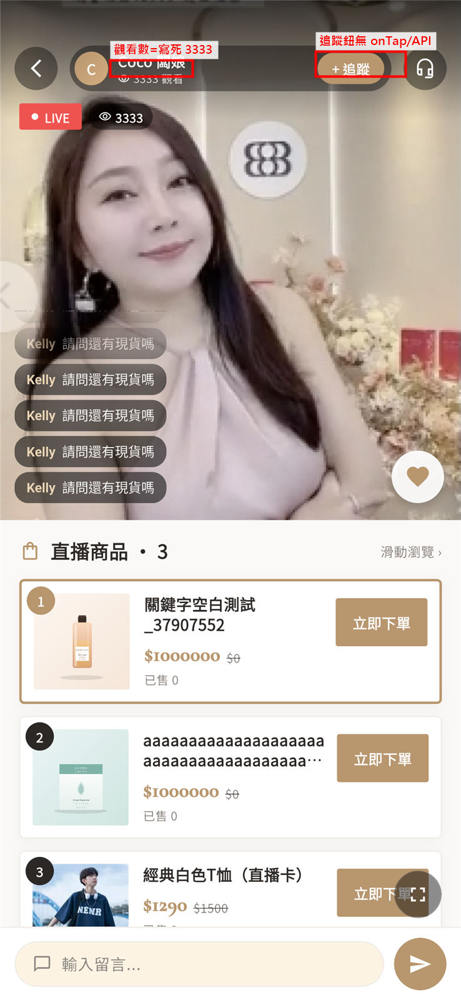 |
| A4 | **~~儲值金 — 無~~ -** `/credit/balance`、`/credit/spend`                  | `TODO-LIST:11`、`lib/screens/shop/checkout_screen.dart:680`（`_DeductionCard`） | API_SPEC.md 有提到儲值金，但 OpenAPI 沒實作。結帳「金額折抵」的購物金欄永遠顯示「有購物金 0 元可使用」。 | _（結帳「金額折抵」區的購物金欄，無獨立截圖）_ |
| A5 | **直播留言（送出 / 列表）** — 無 `/live/{id}/comments`、無 WebSocket              | `lib/data/repositories/live_repository.dart:48-60`、`lib/screens/live/live_room_screen.dart:134` | **現況**：App 已呼叫 `/api/v1/mall/live/{id}/comments`（api_constants.dart:185-186）但路徑不在 OpenAPI；畫面留言是 `MockData.liveComments` 循環播放，送出只在本機 append（`live_provider` `sendComment` 樂觀更新、**不上傳**）。 **後端需提供**： ① `GET /live/{id}/comments`（分頁或 `?since=<last_id>`）取留言，每筆 `id` / `username` / `avatar` / `content` / `created_at`； ② `POST /live/{id}/comments` `{content}` 送出留言； ③ **即時推送**：直播留言必須即時 → WebSocket 推新留言（輪詢只能當備援）； ④ 主播身分資訊配合 C15。 | 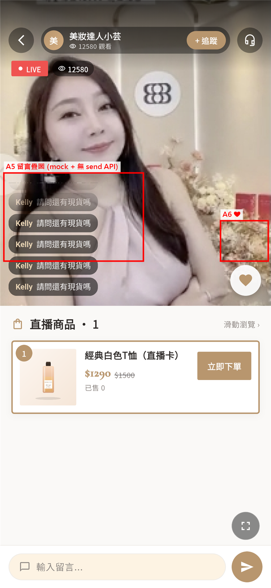 |
| A6 | **~~直播愛心 / 禮物 / 分享~~** — 無對應 endpoint                                | `lib/screens/live/live_room_screen.dart:106-135` | 純前端動畫，❤ 只在本機放愛心動畫，不會送到後端。 | _（見 A5 截圖右側 ❤）_ |
| A7 | **直播回放 / 短影音輪播** — 無 `/v1/mall/live/history`                         | 首頁短影音輪播 `lib/screens/home/home_screen.dart:529`；影片購物頁「回放」分頁 `lib/screens/live/live_screen.dart:53,86-90`；端點常數 `api_constants.dart:234`（`historicalLives`） | **現況**：兩處共用 `LiveRepository.fetchHistoricalLives()`（`live_repository.dart:35-46`）打 `/api/v1/mall/live/history`，但路徑不在 OpenAPI 內。首頁輪播失敗時 fallback 假資料；影片購物「回放」分頁取不到資料時直接顯示「尚無回放」空狀態。 **後端需提供**： ① `GET /lives/replays`（或正式補上 `/live/history`，分頁）→ 已結束直播的回放列表，每筆 `id` / `title` / `cover_url` / `vod_url`（可播放的錄影 URL）/ `duration` / `streamer`（接 C15）/ `viewers` / `ended_at`； ② 若為短影音另帶 `video_url` / `thumbnail`； ③ 回放詳情可重用直播間版面，綁定商品見 A19。 | 首頁輪播 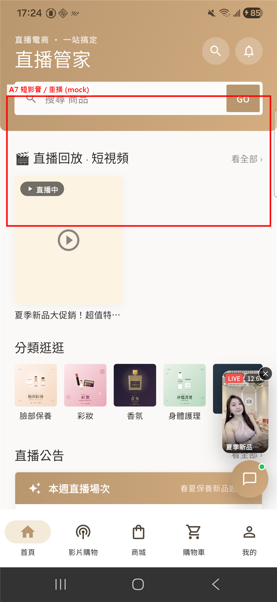 回放分頁 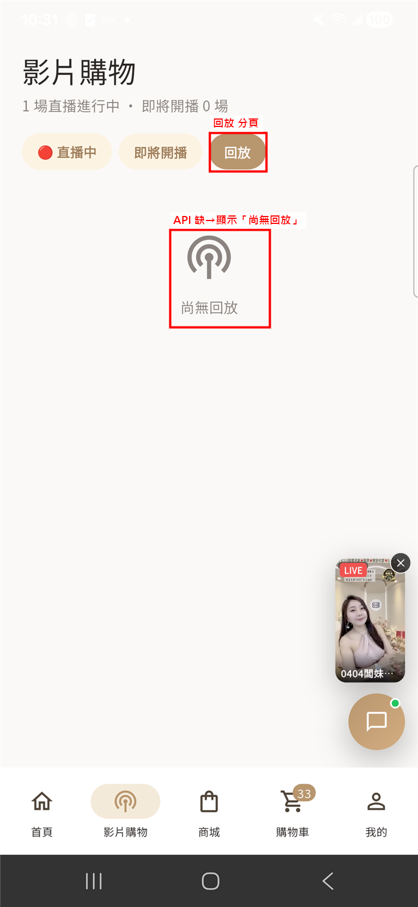 |
| A8 | **每週直播預告 / 即將開播** — 無 `/lives/schedule`、`/lives/upcoming`             | 首頁「本週直播場次」`lib/screens/home/home_screen.dart:754-759`；影片購物頁「即將開播」分頁 `lib/screens/live/live_screen.dart:52,84-85` | **現況**：兩處皆無真資料來源：首頁兩筆寫死（「春夏保養新品開箱會」「時尚妝容挑戰」）；影片購物「即將開播」分頁直接 `upcoming = const <LiveStream>[]`（live_screen.dart:52，`TODO(API): /lives/upcoming`），永遠顯示「近期沒有預告場次」。 **後端需提供**： ① `GET /lives/upcoming`（影片購物「即將開播」分頁用）→ 即將開播場次，每筆 `id` / `title` / `cover_url` / `streamer` / `scheduled_at`（預定開播時間）/ `reminder_set`（本會員是否已設提醒）； ② `GET /lives/schedule?week=current`（首頁「本週直播場次」用）→ 依日期分組的預告； ③（選配）`POST /lives/{id}/reminder` 設開播提醒，到點推播（接 A2 通知中心）。 | 首頁預告 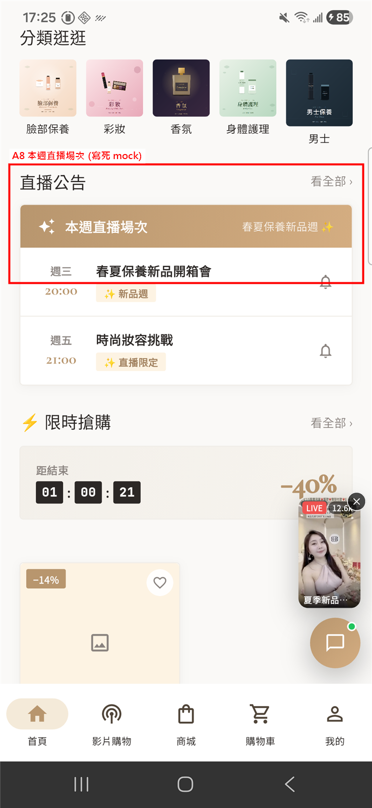 即將開播分頁 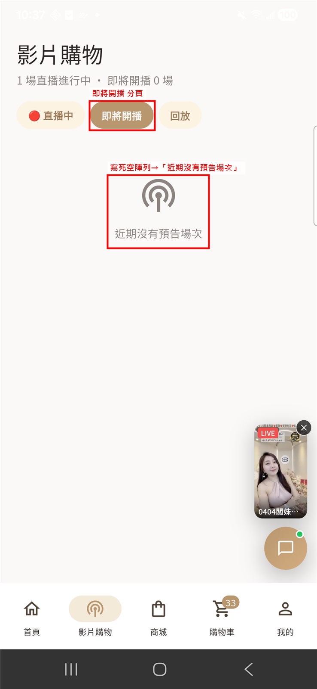 |
| A9 | **客服聊天（線上文字客服）** — 無客服後端（曾查 `/support`、`/chat`、`/cs`、`/ticket` 皆無；此四者非四種功能，是同一「客服」能力的不同命名） | `lib/screens/support/support_screen.dart:14`（`TODO(API): GET/POST /support/messages`） | **現況**：純本機關鍵字機器人——`_autoReply()` 比對「出貨/退貨/尺寸/真人」回罐頭句，訊息只存 in-memory `_messages`，關頁即消失；無真實傳輸、無歷史、無真人客服，頂部「線上中」綠點與頭像「C」皆裝飾。 **後端需提供**（路徑命名擇一即可：`/support`≈`/cs`＝客服對話、`/chat`＝即時訊息、`/ticket`＝可追蹤工單）： ① `GET /support/messages`（分頁）取對話歷史，每筆含 `id` / `sender`（`member`\|`agent`\|`system`）/ `content` / `created_at` / `is_read`； ② `POST /support/messages` body `{content}` 送出會員訊息並回存； ③ 客服／系統回覆的**即時推送**（WebSocket，或前端輪詢 `?since=<last_id>`）； ④ **真人客服轉接**：可標記轉接專員與排隊／指派狀態（目前「真人客服」chip 只回罐頭句）； ⑤（選配）退換貨／售後若需案件編號可追蹤，另以 `/ticket` 建立／查詢工單（與 A10 售後重疊）。 | 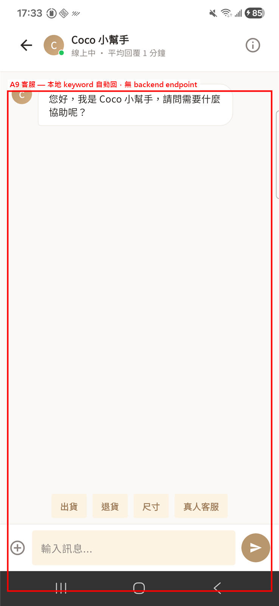 |
| A10 | **退款 / 退貨 / 售後** — 無 `/refund`、`/return`、`/aftersale`                | `lib/screens/profile/profile_screen.dart:115-117` | **現況**：個人頁「退款」四宮格數字永遠 0，點進去只是篩過的訂單列表，**沒有任何售後操作**（無法申請退款／退貨／換貨）。 **後端需提供**： ① 建立售後單 `POST /aftersale` `{purchase_id, items[], type（`refund`\|`return`\|`exchange`）, reason, images[]}`； ② `GET /aftersale`（分頁，可帶 `status`）列我的售後單、`GET /aftersale/{id}` 取明細與進度時間軸； ③ 訂單統計補 `refunded_count` / `aftersale_count`（見 C6），讓四宮格數字正確； ④（選配）`POST /aftersale/{id}/cancel` 取消申請。 | 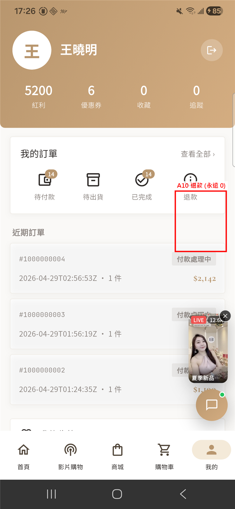 |
| A11 | **物流追蹤** — 無 `/tracking`，Purchase 缺 `tracking_no`                    | `lib/data/repositories/purchase_repository.dart:122-133` | **現況**：訂單卡缺物流欄位，「配送進度／明細」只展開訂單時間戳，沒有真正的物流節點。 **後端需提供**： ① `GET /purchases/{id}` 的 fulfillment 補 `tracking_no` / `tracking_url` / `carrier_name`（C7 已補 `tracking_no`、仍缺後兩者）； ② （進階）物流節點時間軸——`GET /tracking/{tracking_no}` 或在 purchase 內嵌 `tracking_events[]`，每筆 `status` / `description` / `location` / `occurred_at`； ③ 出貨時推一筆通知（接 A2 通知中心）。 | 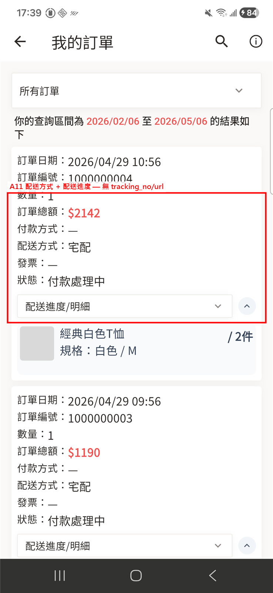 |
| A12 | **~~檢貨功能~~** — 無相關路徑                                                 | `TODO-LIST:1` | TODO-LIST 標「?」，還沒有畫面。 | _（無畫面）_ |
| A13 | **Token 更新** — 無 `/v1/mall/auth/refresh`                             | `lib/config/api_constants.dart:22-23`，`DioClient` 401 攔截器用 | App 在 401 時會呼叫，但不在 OpenAPI 內。Session 過期目前沒提示。 | _（無畫面）_ |
| A14 | **App 強制更新設定** — 無會員端 `/v1/mall/app/setting`                         | `lib/config/api_constants.dart:38` | `AppSettingResource` schema 有，但只接到後台 `/api/v1/backend/...`；會員端沒有 GET，上線後無法強制更新。 | _（無畫面）_ |
| A15 | **遠端主題 JSON** — 無 `/theme/{id}`                                      | `lib/config/api_constants.dart:41`、`RemoteThemeBuilder` | App 抓各商家主題 JSON，但不在 OpenAPI 內。路徑錯誤時會默默退回預設主題。 | _（無畫面）_ |
| A16 | **`GET /me/isRegistered`** `[2026-05 待後端上線]` — 註冊前置檢查                | `api_constants.dart` `mallIsRegistered`、`auth_repository.dart` `isRegistered({loginType, accessToken})` | 只出現在 `api (5).json`，`API_DOCUMENT.json` 0 筆。App 已做好，等後端部署。 | _（前置檢查，無畫面）_ |
| A17 | **`GET /me/boundAccounts`** `[2026-05 待後端上線]` — 帳號整合列表               | `api_constants.dart` `meBoundAccounts`、`auth_repository.dart` `fetchBoundAccounts()` | 新 endpoint，`API_DOCUMENT.json` 0 筆。App 已做好，UI 未接（帳號整合頁未建）。 | _（無畫面）_ |
| A18 | **`GET /bonus/history`** `[2026-05 待後端上線]` — 紅利歷史合併端點（取代 B1/B2 分開呼叫） | `api_constants.dart` `bonusHistory`、`bonus_repository.dart` `fetchHistory({startDate, endDate, pageSize})`、`BonusHistory`（`type: earning\|usage` + 帶正負號的 `pointAmount`） | 新 endpoint，`API_DOCUMENT.json` 0 筆。App 已做好，UI 未接。 | _（無畫面）_ |
| A19 | **直播商品綁定** — 無 `GET /lives/{id}/products`                              | `lib/screens/live/live_room_screen.dart:33-34,143-161` | **現況**：直播間「直播商品」沒有 per-live 端點。畫面改用 `productListProvider(ProductFilter())`（一般商品目錄 `GET /productCard`）取前 4 筆（`take(4)`）充當；商品本身是 `/productCard` 真資料，但與當前直播 / 主播無關——任何直播間都顯示**同一份**目錄前幾筆（實機驗證見截圖）。 **後端需提供**： ① `GET /lives/{id}/products`（或 `/market/live/{id}/products`）→ 該場直播綁定的商品（依主播上架順序），每筆為 productCard 摘要 + 直播專屬欄位：`live_price`（直播價）/ `pinned`（是否置頂講解）/ `sort`； ② （即時）主播切換「正在講解」的商品時推送 active product id（可走 A5 的 WebSocket 通道）； ③ 與 A5 留言、C15 主播資訊同屬直播間即時資料。 | 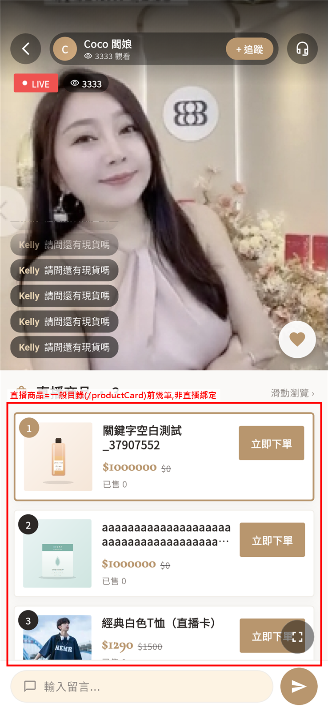 |

---

## B. API 已存在，前端接線狀況（🟢 前端工作）

| # | 已存在的 endpoint | 要接到哪 | 狀態 |
|---|---|---|---|
| B1 | `GET /bonus/earning` | 個人頁 → 紅利歷史（整頁未做） | 常數有（api_constants.dart:146），缺 repo 方法。 |
| B2 | `GET /bonus/usage` | 同 B1 | 常數有（api_constants.dart:147），缺 repo 方法。 |
| B3 | `POST /me/bindThirdParty` | 個人頁 → 帳號整合 / 第三方綁定（整頁未做） | 常數與 UI 都缺。 |
| B4 | `POST /me/bindMobile` + `me/verifyOtp` | 綁定手機流程 | ✅ 已完成（2026-05-06）。`meBindMobile` + `meVerifyOtp` 常數、`AuthRepository.bindMobile()` + `verifyBindMobileOtp()`、`BindMobileScreen` 兩步驟 UI（`/settings/bind-mobile`）；個人頁「尚未綁定手機」在 `!hasBoundMobile` 時導向此頁。 |
| B5 | `POST /me/password` | 個人頁 → 修改密碼（原本無入口） | ✅ 已完成（2026-05-06）。`mePassword` 常數、`AuthRepository.changePassword()`、`ChangePasswordScreen`（`/settings/password`）；選單新增「修改密碼」。 |
| B6 | `POST /password/forgot` + `verifyOtp` + `reset` | 登入 → 忘記密碼三步驟 | ✅ 已實作。`AuthRepository.forgotPassword/verifyPasswordOtp/resetPassword`、`ForgotPasswordScreen`（手機→OTP→新密碼→完成）；登入頁「忘記密碼？」可進入。 |
| B7 | `POST /coupon/member/redeem` | 優惠券頁「輸入兌換碼」 | ⚠️ 後端已標 `deprecated`：「廢棄此功能，優惠券的兌換將會在結帳流程中直接處理」。**不可呼叫**；正確流程是結帳的 `cart/checkout/coupon/apply`（已接在 `_CouponSection`）。常數保留並加 `@Deprecated`。 |
| B8 | `POST /storeCollection/list` + `/{id}` | 商城首頁「主題館」區 | ✅ 已完成（2026-05-06）。`storeCollections` + `storeCollection(id)` 常數、`StoreCollection` model、`ContentRepository.fetchStoreCollections()`、`storeCollectionsProvider`；`shop_screen.dart` 在 banner 與直播公告間渲染 `_StoreCollectionSection`。 |
| B9 | `GET /upsell` | 商品詳情「加購區」 | ✅ 已完成（2026-05-06）。`ProductCardDetail.categoryId`、`UpsellItem` model、`ProductRepository.fetchUpsell()`、`upsellProvider`；`product_detail_screen.dart` 的 `_UpsellSection`。卡別→賣場類型對應（1→1、其餘→4）。 |
| B10 | ~~`GET /address/storePickup/method`~~ → `GET /cart/checkout/shippingOptions` | 結帳「配送方式」— 上層類型（宅配 / 超商）+ 品牌選擇 | ✅ 完成（2026-05-06），**2026-05-08 改版**改接新的 `/cart/checkout/shippingOptions`。`CartDeliveryType` model、`CheckoutRepository.fetchShippingOptions()`、`checkoutShippingOptionsProvider`；`_ShippingCard` 顯示宅配/超商 radio + 超商品牌 chip。後端只給類型與品牌，不暴露底層 provider id。 |
| B11 | `GET /market/groupPost` + `fanPagePost` | 直播相關貼文牆（原本無 UI） | ✅ 已完成（2026-05-06）。`SocialPostMarket` model、`MarketRepository.fetchGroupPostMarkets()` + `fetchFanPagePostMarkets()`、對應 provider；`live_screen.dart` 直播中 tab 渲染兩個 `_SocialPostSection`。 |
| B12 | `POST /auth/psid/generateToken` | FB PSID 登入流程 | 尚無呼叫端。 |
| B13 | `GET /cart/checkout/shippingOptions`（2026-05 新 endpoint） | 結帳 — 見 B10 | ✅ 已完成（2026-05-08），與 B10 改版同批。 |
| B14 | `GET/POST /address/homeDelivery` + `/storePickup`（+ `/{id}/destroy`、`/{id}/default`、`/countries`） | 個人中心「收件地址」管理頁 | ✅ 已完成（2026-06-09）。先前資料層（model/repository/provider）全 ready 但**無 UI**，是獨立 gap。本次補上：`address_book_screen.dart`（宅配/超商雙 tab 列表＋設預設＋刪除＋空狀態，超商卡顯示 C13 `warning_message`）、`address_form_sheet.dart`（新增表單）、路由 `/settings/address`、profile 選單入口「收件地址」。風格走 `context.appTheme.*`。實機驗證 UI 全正確。⚠️ 後端 store 1 的 `countries` 為空，故目前無法在 App 內實際建立地址（見 C13）。 |

---

## C. API 有，但回傳缺欄位（🟡 需後端補欄位）

| # | Endpoint | 缺的欄位 | 證據 / 現況 |
|---|---|---|---|
| C1 | `GET /productCard` | `sold_amount`（銷量）`[後端未部署]` | ⚠️ 更正（2026-06-09  實測）：`api (6).json` 有定義 `sold_amount`，但 UAT 後端 productCard **list 與 detail（productCard/34）實測都未回**此欄位。App 端已 ready（`_parseProduct` 讀 `card['sold_amount']` 進 `sales`，缺時 fallback 用 id hash 假數）。等後端部署。 |
| C2 | `GET /category` | ~~`image_url`~~（分類圖片網址） | ✅ 已解決（2026-06-09  實測）：category response **已回** `image_url`（如 `http://api-uat-1.../images/categories/default.jpg`，每個分類與子分類都有）。App 端 `home_screen.dart:683-693` 仍寫死 `assets/prototype/categories/`，可改吃 `image_url`（屬 App 待接小工項）。 |
| C3 | `GET /cart`（CartItem） | `host_id` / `streamer_name`（主播 ID / 主播名稱） | **現況**：購物車要**依直播主播分組**（同一場直播買的商品歸一組），但 CartItem 沒帶來源主播 → `cart_screen.dart:30-99` 只能用 `同 id 分成4 個假的分組`。**後端需提供**：每筆 CartItem 回 `host_id` + `streamer_name`（該商品所屬直播／賣場的主播；與 C15 主播資訊同源），App 即可正確分組。(或另外寫一隻給觀眾版使用的 API) |
| C4 | `GET /cart`（CartItem） | `gift_items[]` (贈品) | **現況**：購物車「贈品」區 `cart_screen.dart:790-826` 寫死。**後端需提供**：CartItem 回 `gift_items[]`，每筆 `{product_name, quantity, image}`，代表此商品附帶的贈品（買 A 送 B，由結帳促銷規則計算）。 |
| C5 | `GET /me` | `favorites_count`、`following_count` (收藏、追蹤數) | `lib/screens/profile/profile_screen.dart:86-87` — 永遠 0。需後端在 `/me` 回這兩個計數（依賴 A1 收藏、A3 追蹤功能上線）。 |
| C6 | `GET /purchases` 統計 | `refunded_count` / `aftersale_count` (退款) | `lib/screens/profile/profile_screen.dart:115` — 退款圖示永遠 0。需後端在訂單統計回這兩個計數（依賴 A10 售後功能上線）。 |
| C7 | `GET /purchases/{id}` fulfillment | `tracking_no`、`tracking_url`、`carrier_name`（物流單號 / 物流追蹤連結 / 物流商名稱） | ⚙️ 部分解決（2026-05-08）。改版加了 `tracking_no`，且 PurchaseResource 多了上層 `fulfillment` 區塊（`shipping_method_name` / `delivery_type` / `pickup_provider` / `recipient_*`）；`PurchaseShipment` model + `_mapShipment()` 已解析。`tracking_url` / `carrier_name` 仍缺，必要時可由 `shipping_method_name` 自行組物流連結。 |
| C8 | `GET /storeCheckoutSetting` | 應一併回 `payment_methods[]`、`invoice_types[]`（付款方式 / 發票類型，搭配 B10 配送） | **現況**：結帳發票 4 種選項 `checkout_screen.dart:36-46` 寫死，付款方式亦無來源。**後端需提供**：`storeCheckoutSetting` 一併回 `payment_methods[]`（每筆 `{id, name, type}`，如貨到付款／信用卡／ATM）與 `invoice_types[]`（每筆 `{id, label}`，如電子發票／手機載具／統編），取代寫死（搭配 B10 配送）。 |
| C9 | `GET /productCard` | 每張卡的 `market_id`（賣場 ID） | **現況**：`product_repository.dart:76-77` 寫死 `market_id: 1`，所有商品都被當成 market 1。**後端需提供**：每張 productCard 回真實所屬 `market_id`（賣場／直播場次 id），App 才能正確對應賣場；直播商品綁定（A19）亦需要。 |
| C10 | `GET /productCard` | `is_orderable`（是否可下單） `[後端未部署]` | App 已做好（`product_repository.dart` `inStock: isOrderable && (stock > 0 …)`）。2026-06-09  實測：UAT productCard **list+detail 都未回** `is_orderable`（同 C1）。`api (6).json` 有定義。加入按鈕 server-gated 行為待後端部署。 |
| C11 | `GET /cart/checkout/preview` | `shipping_fee_reason`（運費計算原因） `[後端未部署]` | App 已做好（`checkout_screen.dart` `_PriceRows._shippingReasonLabel`：`NEEDS_ADDRESS_SELECTION` / `ADDRESS_NOT_FOUND_OR_UNAUTHORIZED` / `NO_AVAILABLE_RATE`）。2026-06-09  實測：未選地址結帳，運費總金額顯示破折號「—」→ 後端回 `shipping_fee=null` 且**未回** reason，App fallback 正確。`api (6).json` 有定義（`CheckoutPreviewResource`）。 |
| C12 | ~~`GET /coupon/member`~~ | `expired=true` query 參數（查詢過期券） | ✅ **後端有套用過濾**（2026-06-09  實測）。決定性數據：`used=1`→2 張、`used=0`（未使用）UI 顯示 ≥4 張未過期券、`used=0&expired=1`→**0 張**。因 0 ≠ ≥4，證明後端確實讀取並套用 `expired` 參數（若忽略應回 ≥4）。已驗「未過期券被正確排除」；唯帳號**無真正過期券**，「過期券正向出現在 expired=1」這半待有樣本再驗。App 端 `coupon_repository.dart` `fetchMemberCoupons(expired:)` 正確送出。 |
| C13 | `StorePickupAddress`（schema） | `matched` / `store_sync_status` / `store_snapshot` / `warning_message`（門市比對結果 / 門市同步狀態 / 門市快照 / 警告訊息） | ⚠️ **無法驗證（後端基礎資料缺）**（2026-06-09  實測）。App 端已 ready：`address.dart` 4 欄解析 + 新地址簿 UI 已能顯示 `warning_message` 警告列（見 B14）。但 UAT 後端 `address/storePickup`、`address/storePickup/countries`、`address/homeDelivery/countries` **三者皆回 `{"data":[]}`** → 國家清單空 → 連超商地址都建不了 → 取不到含 4 新欄位的樣本。根因是 store 1 的地址基礎設定資料缺失，需後端先補 countries。 |
| C14 | `GET /cart/checkout/preview` | 接受 `address_id` / `delivery_type` / `payment_method_id` query（地址 ID / 配送類型 / 付款方式 ID） | ⚙️ **App 端已送、後端未套用**（2026-06-09 實機抓封包）。**App 端 ✅**：使用者每次切換地址 / 配送方式 / 付款方式，`checkoutPreviewProvider`（watch `checkoutProvider`）即自動帶新參數重打 preview；實測 `delivery_type` 隨選擇正確變動（宅配回 `home`、改超商後重抓變 `pickup`），`payment_method_id` 也正確附帶。落點：`checkout_repository.dart` `preview(...)`。**後端 ❌**：三個參數有收到但未據以計算，無論選什麼運費恆回 `null`（即 C11 結帳運費顯示「—」之根因）。**待辦**：後端依 `address_id` / `delivery_type` / `payment_method_id` 計算運費後回傳。 |
| C15 | `GET /market/live`（`LiveMarketResource`） | **主播名**（建議 `streamer_name` / `host_name`）、**主播大頭貼 url**（建議 `streamer_avatar_url` / `host_avatar`）`[後端需新增欄位]`；另缺 `viewers`（觀看數） | 🔴 **後端需新增欄位（2026-06-10 登入態實機抓 log 已確認）**。`GET /market/live` 真實 response 僅回 `id` / `store_id` / `market_type` / `market_type_label`（"直播"）/ `name`（"0404闆妹兒童節快樂大促銷"）/ `is_active` / `started_at` / `ended_at` / `created_at` / `updated_at` / `live{id,provider,provider_stream_id}` —— **無主播名、無大頭貼 url、無 `viewers`、無 `likes`**。→ **後端需在 `LiveMarketResource` 新增「主播名」與「主播大頭貼照片 url」兩個欄位**（並建議一併補 `viewers`/`likes`）。App 端現況：`LiveStream.fromJson`（`live_stream.dart:22-34`）未解析這些欄位 → 直播間主播名走 fallback「Coco 闆娘」（`live_room_screen.dart:581`）、大頭貼為主播名首字色塊（`:563-570`）、觀看數寫死 **3333**（`:596,1266`）、愛心數恆 0（連帶 A6）；且無 WebSocket / 輪詢，即使有值也不即時更新。後端補欄位後 App 接線即生效。見截圖  |

### 向後相容策略（適用所有 `[2026-05 待後端上線]` 條目）

所有新欄位都走「新 key 優先 → 舊 key fallback → 預設值」三段式解析
（例：`card['variants'] ?? card['variant'] ?? const []`）。後端尚未上線新 spec 前，
App 畫面與 2026-05-06 完全相同；後端切換後 App 不需再發版。

**改版中本來就存在於舊 spec、不需追蹤的項目（純 refactor）：**
`ProductCard.variants[]`（舊 spec 已有 9 處）、`BannerResource.images`
（舊 spec 已有 1 處，只是 shape 變嚴格）、`MemberCoupon.usable_end_time`
（舊 spec 已有 8 處）。

---

## D. _（2026-05-06 移除）_

> D 段原本列「App 有呼叫、但不在 OpenAPI 內、待後端確認」的路徑。
> 重新對照 `API_DOCUMENT.json` 後（`auth/refresh`、`app/setting`、`theme/{`、
> `live/history`、`live/{id}/comments` 皆 0 筆），確認全部缺少，**升級併入 A 段**：

| 原編號 | 新編號 |
|---|---|
| D1 `auth/refresh` | A13 |
| D2 `app/setting` | A14 |
| D3 `theme/{id}` | A15 |
| D4 `live/history` | 併入 A7 |
| D5 `live/{id}/comments` | 併入 A5 |

---

## E. API 有，但後端回 500 / SQL 錯誤

> 2026-05-06 對 `api-uat-1.xsmartlive.com` 開 debug log 實測。
> 部分 endpoint 回 HTTP 200 但 body 是 `{"code":30000,...}` — App 視為失敗（回空陣列）。

| # | Endpoint | 錯誤 |
|---|---|---|
| E1 | `GET /category` | `Call to undefined method App\Models\Category::combo()`（TODO-LIST:25） |
| E2 | `POST /storeCollection/list` | 500 / `{"code":30000,"message":"取得 StoreCollection 失敗"}` — `StoreCollectionRepository::getActiveCollection` 例外。App 端 B8 接線正確，區塊在後端修好前自動隱藏。 |
| E3 | `GET /upsell` | 200 / `{"code":30000,...}` — `SQLSTATE[42S22]: Unknown column 'ucs.target_type'`（`upsell_campaign_scope` 缺 migration）。App 端 B9 接線正確。 |
| E4 | ~~`GET /address/storePickup/method`~~ | 200 / `{"code":30000,...}` — `SQLSTATE[42S02]: Table 'xsmartlive.store_shipping_option' doesn't exist`。**2026-05-08 已淘汰**：結帳配送選擇改接 `/cart/checkout/shippingOptions`（見 B10），此 endpoint 仍被地址簿頁面引用但已不影響結帳。 |

---

## 與初版報告的修正

| 初版說法 | 實際情況 | 修正於 |
|---|---|---|
| 🔴 帳號整合 API 缺少 | API 存在於 `me/bindThirdParty`，缺的是 UI | B3 |
| 🔴 紅利歷史 API 缺少 | API 存在於 `bonus/earning` + `bonus/usage`，缺 repo + UI | B1、B2 |
| 🔴 結帳付款 / 配送列表缺少 | 配送 `address/storePickup/method` 存在；付款應從 `storeCheckoutSetting` 來 | B10、C8 |
| 🔴 商城分類 API 缺少 | 路徑存在，後端回 500 | E1 |
| 🟡 storeCollection 可能是收藏 | 它是「主題館」（精選商品集），與會員收藏無關 | A1 vs B8 |
| 🔵 marketGroupPosts / fanPagePosts 無呼叫端 | API 確實存在，是對應功能（IG/FB 貼文牆）整個沒做 | B11 |
| 🟡 productCard `sales`（銷量）缺少 | `api (6).json` 有 `sold_amount`，但 UAT 後端實測未部署未回（先前誤標已解決） | C1 |
| 🟡 category 缺 `image_url` | 後端實測**已回** `image_url`，改為 App 待接 | C2 |
| 🔴 App 無地址簿 UI | 後端 API + 資料層早就 ready，僅缺 UI；2026-06-09 已補上 | B14 |
