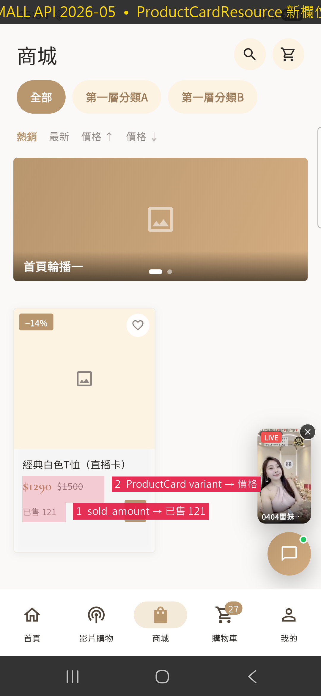

# MALL API 2026-05 — 三星手機 UI 變更點截圖

擷取裝置：**Samsung Galaxy S22 (SM-S9280)**, 1080×2340 @ 450dpi
APK：`build/app/outputs/flutter-apk/app-default-debug.apk` (2026-05-26 16:09 build，包含 MALL API diff working tree 改動)

## 視覺可見變更

### 商城頁 — `02_tap_shop_annotated.png`



| # | UI 元素 | 對應 API 欄位 | 程式碼位置 |
|---|---------|---------------|-----------|
| ① | `$1290 $1500` 價格列 | `ProductCardResource.variants[]` (原 `variant[]`) | `lib/data/repositories/product_repository.dart:243-260` |
| ② | `已售 121` | `ProductCardResource.sold_amount` (新增) | `lib/data/repositories/product_repository.dart:276` |

關鍵 diff：

```dart
// product_repository.dart  _parseProduct
final variants = (card['variants'] as List<dynamic>?) ??
    (card['variant']  as List<dynamic>?) ??  // legacy fallback
    const [];
…
sales: (card['sold_amount'] as num?)?.toInt() ?? 0,        // ← 已售 121
inStock: isOrderable && (firstVariant?['stock'] > 0 …)   // ← is_orderable gate
```

## 登入後抓到的視覺驗證（2026-05-27 補抓）

下列在登入測試帳號（測試會員A，紅利 5200 / 優惠券 16）後抓到，對應 `API_GAPS.md` Section C 的 `[2026-05 spec pending]` 條目。

| 截圖 | 對應 audit 條目 | UI 觀察 |
|------|----------------|---------|
| `F5-shipping-fee-reason.png` | **C11** — `CheckoutPreview.shipping_fee_reason` | 結帳「運費總金額 —」(em-dash)：後端尚未回 reason 時 UI fallback 顯示 dash，待新 spec 上線後會顯示「尚未選擇地址」等中文 |
| `F6-coupon-expired.png` | **C12** — `coupon/member?expired=true` query | 我的優惠券頁 4 個 tab 含「已過期」，server 回空陣列 → 空狀態（無法從畫面區分 filter 正常 vs 被忽略） |
| `F11-pickup-brand.png` | **C13** — `StorePickupAddress.matched` / `warning_message` | 配送方式切到「超商取貨」後展開 7-11 / 全家 chip；warning bar 待後端回 `matched=false` 才顯示 |
| `F7-coupon-usable-end-time.png` | _(已在舊 spec，非 gap)_ | 卡片顯示「有效期限至 2026.06.30 15:59」、「2026.09.30 15:59」— `usable_end_time` 舊 spec 已支援 |

## Refactor-only 變更（非 gap）

下列改動是新 spec 換 key 或收緊 shape，舊 spec 已支援 — 已透過
backward-compat fallback 讓畫面不破，**不列入 API_GAPS.md**。

- `variants[]` 取代 `variant[]`（舊 spec 已有 9 處）
- `images` (tuple) 收緊 `image` (array) 形狀（舊 spec 已有 1 處）
- `usable_end_time` 取代 `expires_at`（舊 spec 已有 8 處）

## 操作流程

```bash
# 1. Build & install
flutter build apk --debug
adb -s R5CX10BAMSZ install -r -d build/app/outputs/flutter-apk/app-default-debug.apk

# 2. Capture
adb -s R5CX10BAMSZ shell screencap -p /sdcard/_s.png
adb -s R5CX10BAMSZ pull /sdcard/_s.png 02_tap_shop.png

# 3. Annotate
python docs/screenshots/mall-api/annotate.py
```
